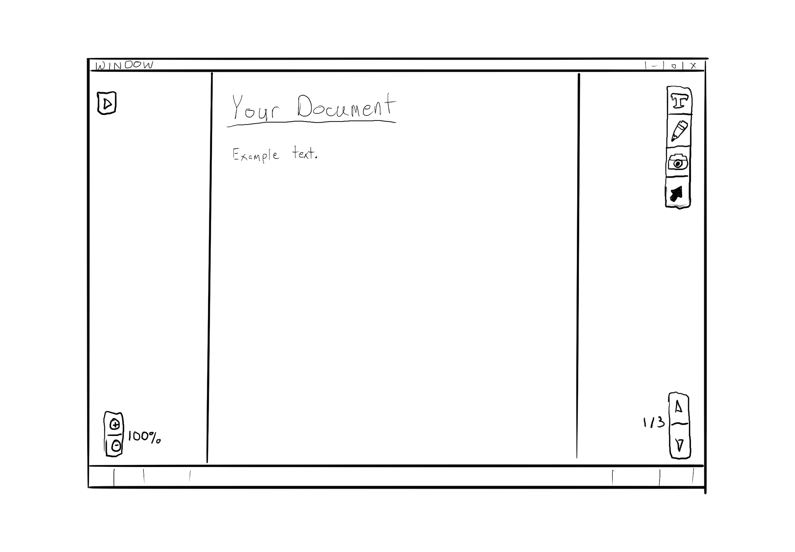

# Week 5

## Notes Document JSON Schema

### Robert

The JSON Schema defining the Notes Document has been expanded.
Each object is gaining its own independent JSON Schema file. 
These will each then be referenced by any parent objects.
Content Blocks will reference Tag objects.
The Notes Document file will reference Content Block files.

As always, the Notes Document Standard documents can be found on this site [here](../docs/schemas.html), and in its own repository [here](https://github.com/Espresso-Notes/NotesDocumentStandard).

## HTML Compiler

### Robert

Minimal advancements made to the compiler itself.
The intention is to incorporate the [Jinja2](https://jinja.palletsprojects.com/en/3.1.x/) templating engine for generated files.
This will allow easier development of the HTML files independent of the content being compiled into them.
Most work done this week is an exploration of Jinja2 in a separate environment to understand its usage.

Work for the following week will be entirely based on the implementation of Jinja2.
The HTML compiler will be utilized in the Editor for previews and rapid compilation to ensure content is accurate.

## Espresso Notes Editor

### Katie, Cody, Emily

Initial thoughts on the design of the Editor have been discussed.
Cody has created some initial images.

# Concepts for User Interface

## Starting Screen

> Selecting "New Document" will bring the user to the main document screen.  
> Selecting "Browse Documents" will allow the user to browse and load previously saved documents from the application's "Notebook" file structure.

## "Browse Documents" Screen

> "Notebooks" act as the application's main front-end file system. Documents will be saved to the Windows file system, but notebooks are used as a way to organize documents in an intuitive way.

## Main Document Screen

> The main interface for viewing and editing documents. The menus and tools are shown on the sides.
> 
> **Left side:**  
>> - The "Quick Menu" button will open up the "Quick Menu" where documents can be saved or loaded.  
>> - The Zoom buttons will allow the document to be zoomed in or out on the screen.
>  
> **Right side:**
>> - The Text tool will allow for text editing using markdown and code block editing.
>> - The Pencil tool will allow for writing and erasing with the mouse.
>> - The Photo tool will allow photos to be uploaded as well as scanned for text and code.
>> - The Selection tool will allow photos and other visual elements to be resized.
>> - The Page selection buttons will allow the user to quickly scroll through a document with multiple pages.

## "Quick Menu" Screen

> The Quick Menu allows the user to save the current document as well as see any other notebooks and documents availablke to view and edit.

## "Save Document" Screen

> Similar to the "Browse Documents" screen, but also allows the user to save the current document to an existing notebook.
