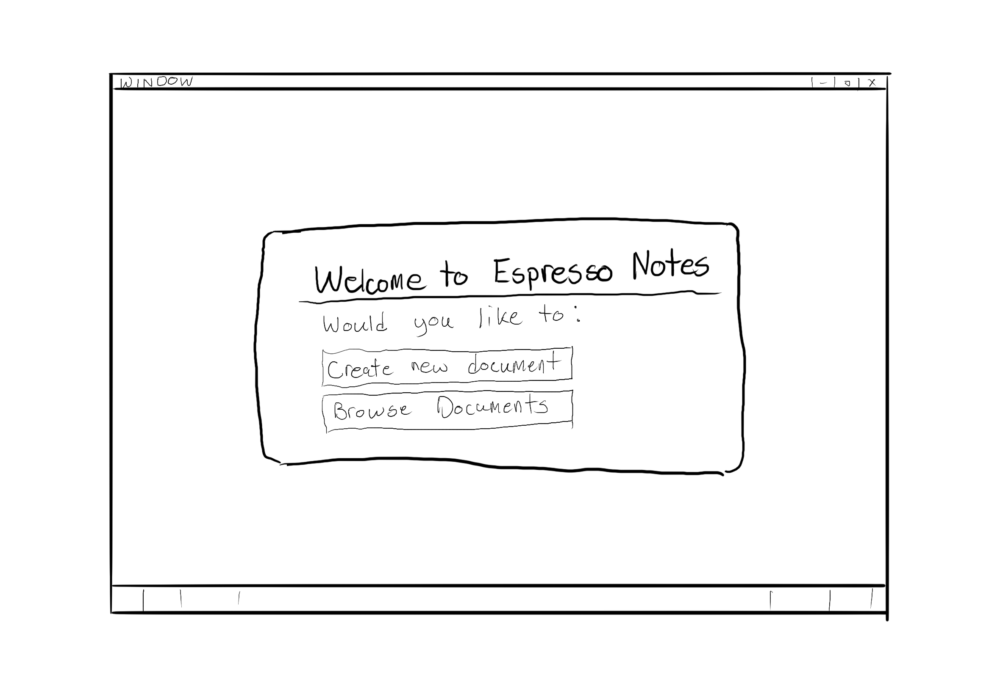
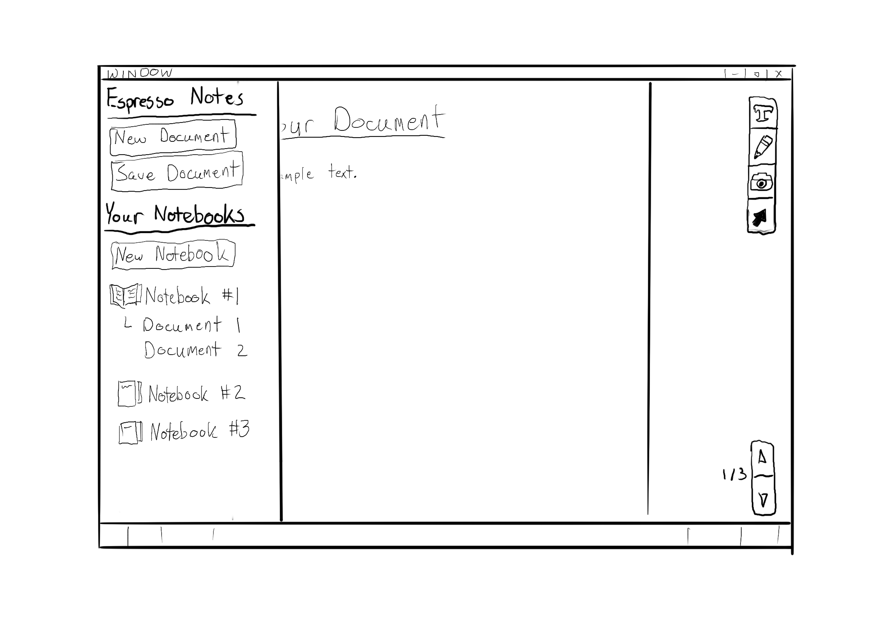
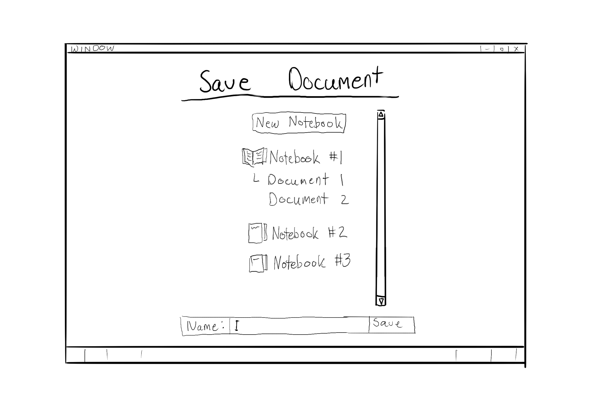
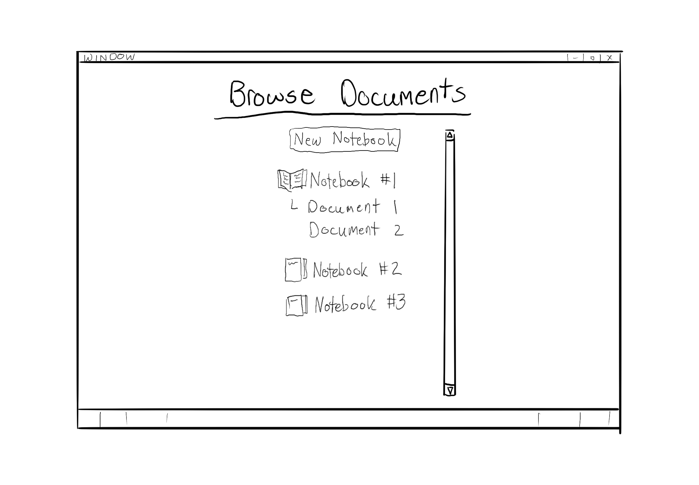

# Week 5

## Notes Document JSON Schema

### Robert

The JSON Schema defining the Notes Document has been expanded.
Each object is gaining its own independent JSON Schema file. 
These will each then be referenced by any parent objects.
Content Blocks will reference Tag objects.
The Notes Document file will reference Content Block files.

As always, the Notes Document Standard documents can be found on this site [here](./docs/schemas.html), and in its own repository [here](https://github.com/Espresso-Notes/NotesDocumentStandard).

## HTML Compiler

### Robert

Minimal advancements made to the compiler itself.
The intention is to incorporate the [Jinja2](https://jinja.palletsprojects.com/en/3.1.x/) templating engine for generated files.
This will allow easier development of the HTML files independent of the content being compiled into them.
Most work done this week is an exploration of Jinja2 in a separate environment to understand its usage.

Work for the following week will be entirely based on the implementation of Jinja2.
The HTML compiler will be utilized in the Editor for previews and rapid compilation to ensure content is accurate.

## Espresso Notes Editor

### Katie, Cody, Emily

Initial thoughts on the design of the Editor have been discussed.
Cody has created some initial images.

#### Start Screen

#### Main Document

#### Quick Menu

#### Save Screen

#### Load Screen

